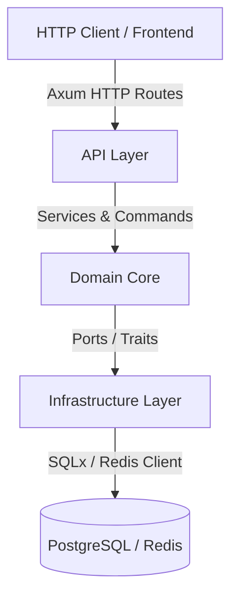
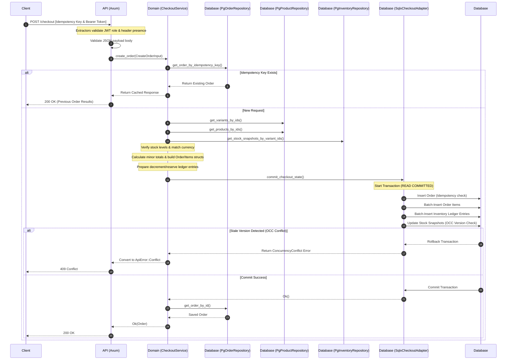

# HAS.LTD Detailed Technical & Architectural Report

This report provides a detailed breakdown of the architectural blueprint, technological choices, database schema design, request processing pipelines, and system workflows for the **HAS.LTD** application.

---

## 1. Architectural Design Principles
The backend of the HAS.LTD application implements **Hexagonal Architecture (Ports and Adapters)**, dividing the codebase into concentric layers that separate core business rules from infrastructure and delivery details.

### Layer Separation
1. **Domain Core (`backend/domain`)**:
   - Contains pure business models, core application services, domain errors, and ports (traits).
   - Has zero dependencies on HTTP servers, SQL frameworks, or caches.
   - Enforces business rules and invariant constraints.
2. **Infrastructure (`backend/infrastructure`)**:
   - Implementations of domain ports (Adapters).
   - Uses SQLx for PostgreSQL persistence and Redis for short-term caching.
   - Manages connection pools and executes raw database queries.
3. **API/Ingress (`backend/api`)**:
   - Built on top of the Axum framework.
   - Maps HTTP requests, deserializes payloads to DTOs, validates inputs, extracts metadata (authentication & idempotency), coordinates domain service calls, and translates domain errors to HTTP response statuses.

---

## 2. Tech Stack & Integration Matrix

### Backend Crate Workspace
- **Rust (Edition 2021)**: Provides strong type safety, memory safety, and high-performance concurrency.
- **Axum (Tokio-Tower-Hyper)**: Selected for routing and request extraction. Fully integrated with Tokio asynchronous runtimes.
- **SQLx (PostgreSQL)**: Handles asynchronous query execution with connection pooling. Used to write performant raw SQL statements and run schema migrations.
- **Redis (via redis crate)**: Used for token validation/revocation and low-latency API idempotency checks.
- **Serde / Serde JSON**: Serialization/deserialization framework used for mapping request payloads and complex database types (JSONB).
- **jsonwebtoken**: Used for signing and verifying JSON Web Tokens (JWT) for authentication.

### Frontend Client SPA
- **React + TypeScript**: The application core, ensuring type consistency across components.
- **Vite**: Modern frontend tooling and bundling system with fast hot-module reloading (HMR).

---

## 3. Database Schema Design

The SQL database is structured to support strong transactional guarantees, inventory audit logging, and concurrency control.

### Core Tables & Types
- **Custom Enums**:
  - `order_state_enum`: `('Pending', 'Reserved', 'Paid', 'Shipped', 'Cancelled')`
  - `ledger_action_enum`: `('Restock', 'Reserve', 'Release', 'Fulfill')`
- **`users`**: Contains identity details, hashed credentials, and role designation (`role VARCHAR(50)`).
- **`verification_tokens`**: Manages verification lifecycle context (e.g. Email validation, password resets) mapped to a specific user.
- **`products` & `product_variants`**: Handles catalog data. Variants include a JSONB `attributes` field (e.g., color, size) and prices stored as `price_minor_units` (integers) to prevent floating-point rounding errors.
- **`orders` & `order_items`**: Persists checkouts. `orders` uses a `version` field for Optimistic Concurrency Control (OCC) and a unique `idempotency_key`.
- **`inventory_ledger`**: An append-only log of all stock changes, enforcing auditability.
- **`inventory_stock_snapshots`**: Tracks current `stock`, `reserved_stock`, and `available_stock` for each variant with versioning for OCC.

---

## 4. Key Request Lifecycles & Workflows

### Checkout Workflow Trace
When a client triggers a POST request to `/checkout`, the system coordinates several steps across the layer boundary:

---

## 5. Security & Authentication Model

1. **Role-Based Access Control (RBAC)**:
   - Evaluated at request time using Axum's custom extraction interface:
     - `RequireCustomer`: Asserts that claims contain the `UserRole::Customer` role.
     - `AuthExtractor`: General authentication parser that decodes token claims into a Rust data structure.
2. **Token Revocation (Redis Blacklisting)**:
   - Active tokens are checked against a Redis blacklisting matrix (`jti` unique claim lookup) to revoke sessions immediately on logout.

---

## 6. Frontend Directory Structure

The frontend leverages a modular structure targeting separation between storefront, administrative settings, and reusable client packages:

- **`src/main.tsx`**: Bootstrapping page component.
- **`src/admin/`**: Houses components, forms, validation hooks, and administration pages.
- **`src/storefront/`**: Customer-facing shopping views, product listing filters, and cart controls.
- **`src/shared/`**: Common assets, global state management definitions, data conversion utilities, and central HTTP configurations.
- **`src/components/` & `src/hooks/`**: Global UI libraries and custom React hooks.
